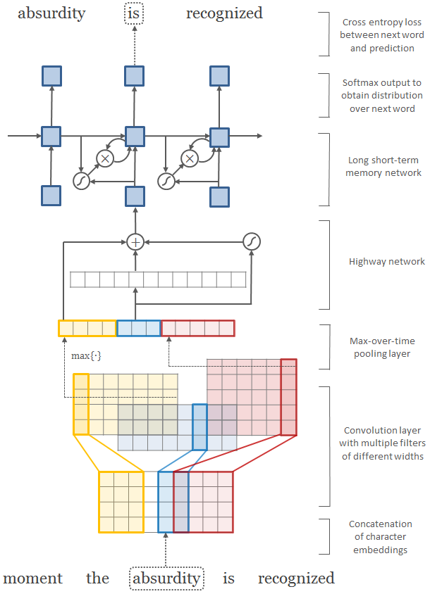

# Character-Aware Neural Language Models

  

Implementation of [Character-Aware Neural Language Models](https://arxiv.org/abs/1508.06615) in PyTorch using TorchText

Current parameters are set at the top of `main.py` for the LSTM-Char-Small model (see tables 2 & 3 in the paper).

Currently implementation does not handle feeding previous hidden state to the model, this can be done elegantly when TorchText handles NestedField's in the BPTTIterator.